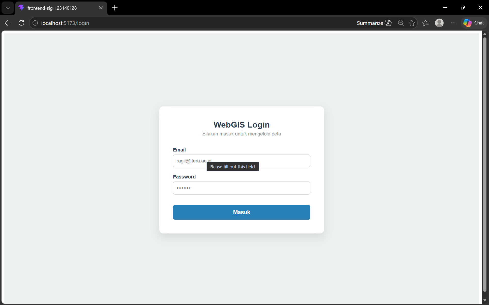
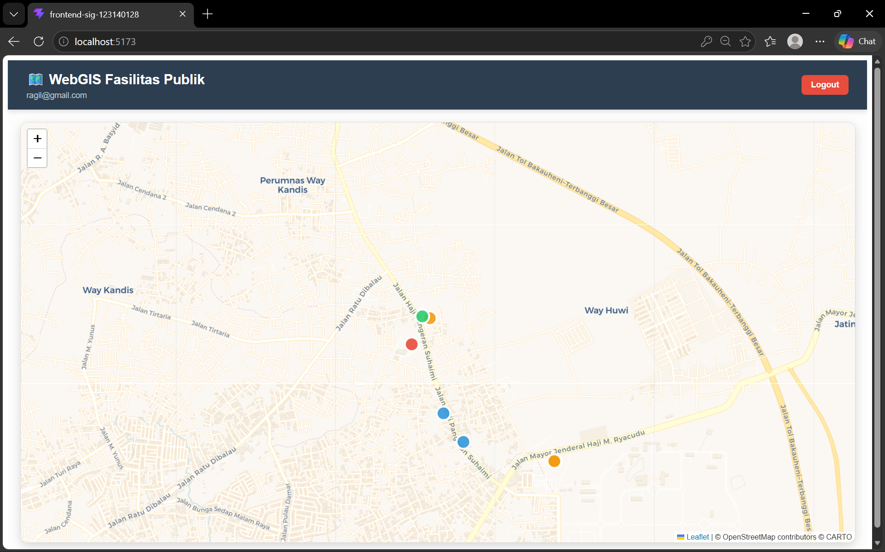
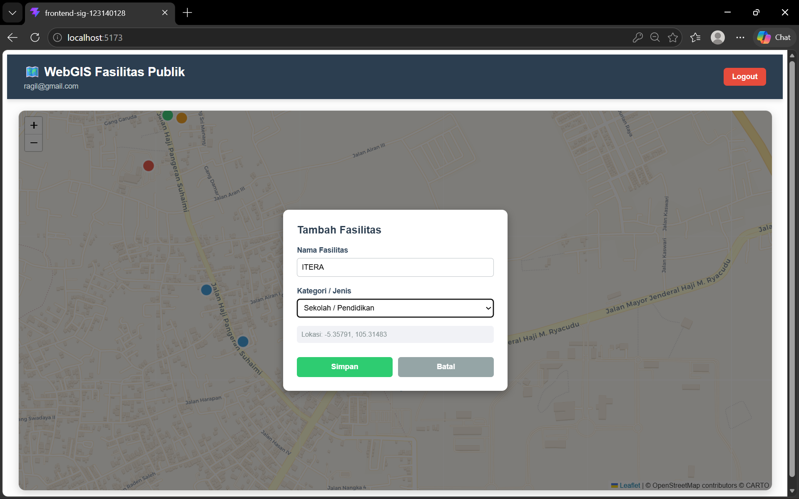
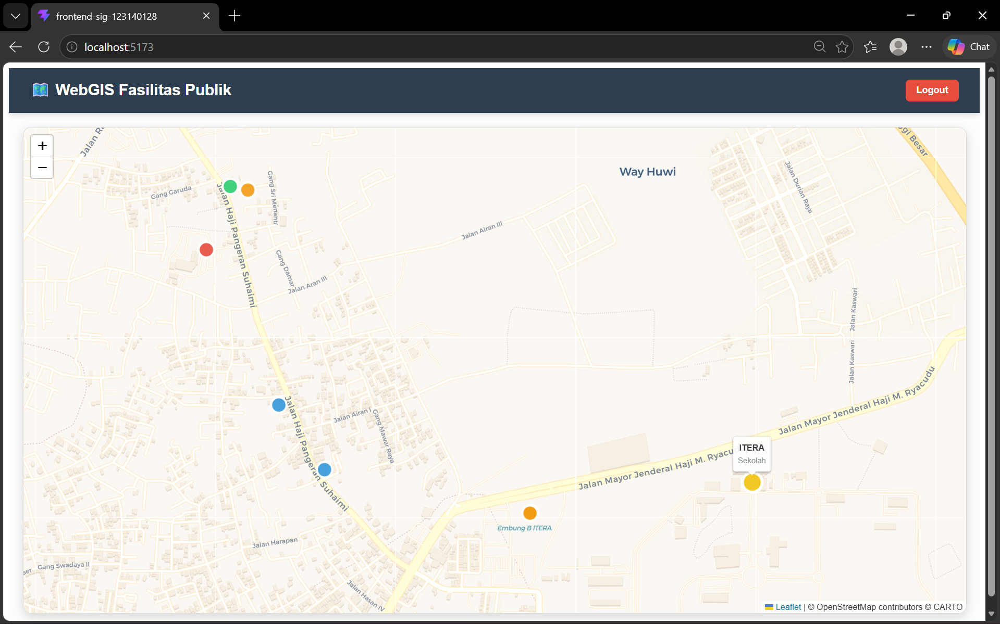
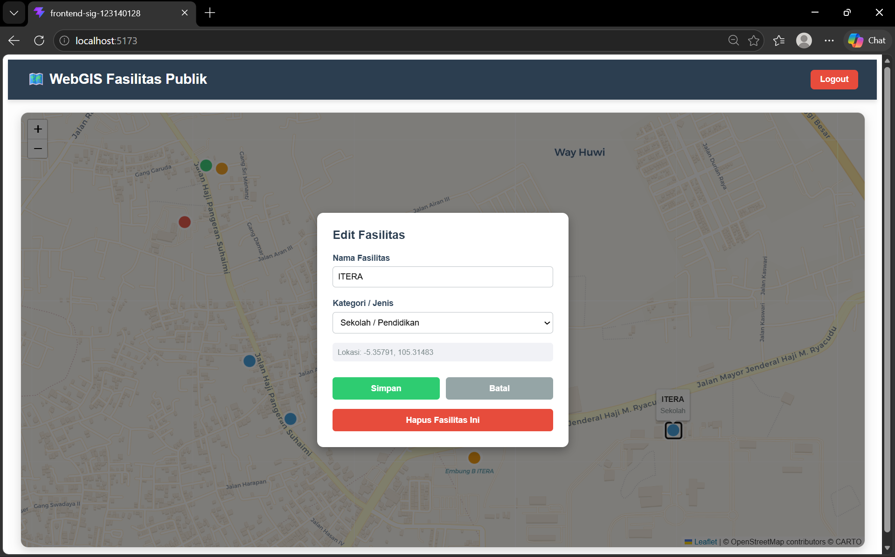

# 🗺️ WebGIS Fasilitas Publik Full-Stack (Pertemuan 9)

**Dibuat oleh:** Ragil Bayu Saputra (123140128)  
**Mata Kuliah:** Sistem Informasi Geografis  

---

## 📖 Deskripsi Proyek
Proyek ini merupakan pengembangan dan kelanjutan dari **Tugas Pertemuan 8**. 

Pada tugas sebelumnya, aplikasi WebGIS ini hanya berfungsi sebagai antarmuka *Read-only* yang menampilkan sebaran data spasial (GeoJSON) dari *database* PostGIS ke dalam peta Leaflet. 

Pada **Tugas Pertemuan 9** ini, aplikasi telah berevolusi menjadi sistem **Full-Stack seutuhnya** dengan penambahan fitur krusial berikut:
1. **Operasi CRUD Interaktif:** Pengguna kini dapat Menambah (Create), Mengubah (Update), dan Menghapus (Delete) titik fasilitas publik secara langsung melalui interaksi klik pada antarmuka peta, tanpa perlu membuka *database* secara manual.
2. **Sistem Keamanan & Autentikasi:** API *backend* kini dikunci menggunakan **JSON Web Token (JWT)**. Fitur *routing* di *frontend* React juga telah dilindungi (*Protected Routes*), sehingga operasi CRUD hanya dapat dilakukan oleh pengguna yang telah terdaftar dan melakukan proses *Login*.

---

## ✨ Fitur Utama
* **Peta Interaktif:** Visualisasi titik lokasi menggunakan Leaflet.js dengan klasifikasi warna dinamis berdasarkan kategori fasilitas (Kesehatan, Pendidikan, Olahraga, Ibadah).
* **Manajemen Data (CRUD):** * Penambahan titik fasilitas baru dengan mengklik area kosong pada peta.
  * Pembaruan dan penghapusan data dengan mengklik *marker* fasilitas yang sudah ada.
* **Axios Interceptor:** Penanganan token sesi secara otomatis pada *header HTTP* untuk menjaga keamanan komunikasi data antara *Frontend* dan *Backend*.

---

## 📸 Dokumentasi Antarmuka (UI)

### 1. Halaman Login (Akses Terbatas)
Gerbang keamanan utama. Pengguna yang belum memiliki token (belum *login*) akan selalu diarahkan ke halaman ini.


### 2. Tampilan Awal Peta Terlindungi
Setelah berhasil *login*, pengguna dapat melihat sebaran fasilitas publik beserta antarmuka utama.


### 3. Tambah Fasilitas (Create)
Form *overlay* interaktif yang muncul saat pengguna mengklik area kosong pada peta untuk merekam koordinat baru.


### 4. Hasil Penambahan Titik Baru
Data fasilitas yang baru saja ditambahkan akan langsung di-*render* secara *real-time* di atas peta.


### 5. Edit dan Hapus Fasilitas (Update & Delete)
Form interaktif yang muncul ketika *marker* yang sudah ada diklik, memungkinkan pengguna untuk mengubah atribut atau menghapus fasilitas dari *database*.


---

## 🛠️ Teknologi yang Digunakan
**Frontend:**
* React.js (Vite)
* React Leaflet (Web Mapping)
* Axios & React Router DOM

**Backend:**
* Python FastAPI
* asyncpg (Asynchronous PostgreSQL client)
* bcrypt & python-jose (Kriptografi dan JWT)

**Database:**
* PostgreSQL + Ekstensi PostGIS (`sig_123140128`)

---

## 🚀 Panduan Instalasi dan Menjalankan Proyek

### 1. Persiapan Database
1. Buat database PostgreSQL baru dengan nama `sig_123140128`.
2. Jalankan perintah `CREATE EXTENSION postgis;`.
3. Pastikan tabel `users` dan `fasilitas_publik` telah dibuat sesuai skema praktikum.

### 2. Menjalankan Backend API
Buka terminal dan arahkan ke direktori backend:
```bash
cd Backend_SIG_123140128
# Install dependencies
pip install -r requirements.txt
# Jalankan server API
uvicorn main:app --reload