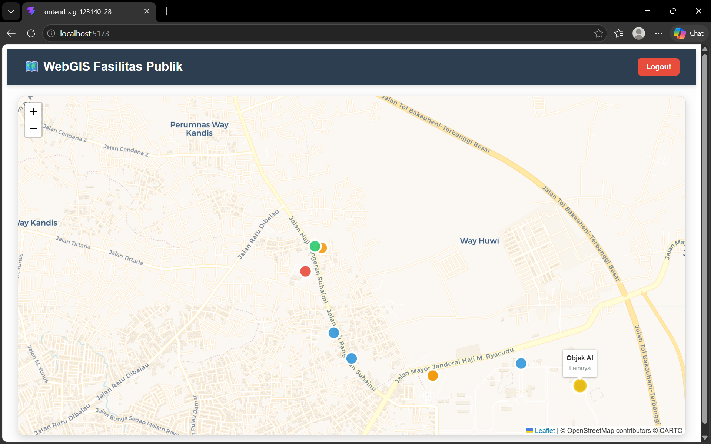

# 🗺️ WebGIS & Spatial AI Pipeline (Pertemuan 10)

**Dibuat oleh:** Ragil Bayu Saputra (123140128)  
**Mata Kuliah:** Sistem Informasi Geografis  

---

## 📖 Deskripsi Proyek
Proyek ini merupakan puncak evolusi dan kelanjutan dari **Tugas Pertemuan 9**. 

Pada tugas sebelumnya, aplikasi WebGIS ini telah menjadi sistem **Full-Stack** dengan fitur CRUD interaktif dan pengamanan *routing* menggunakan JWT (JSON Web Token). 

Pada **Tugas Pertemuan 10** ini, sistem di-*upgrade* dengan mengintegrasikan **Kecerdasan Buatan (Spatial AI)**. Sebuah *pipeline* terpisah dibangun untuk memproses citra udara/satelit, mendeteksi objek secara otomatis menggunakan model Computer Vision, melakukan kalkulasi georeferensi dari piksel ke titik koordinat Bumi (Lat/Lon), dan menyuntikkannya langsung ke dalam *database* PostGIS secara *real-time* tanpa intervensi manual.

---

## ✨ Fitur Utama
* **Integrasi Spatial AI:** Pemrosesan gambar menggunakan model YOLOv8 untuk deteksi objek (misal: bangunan, kendaraan) dan konversi otomatis menjadi data spasial.
* **Otomatisasi Georeferensi:** Transformasi sistem koordinat matriks piksel (X, Y) menjadi koordinat geografis (Longitude, Latitude) menggunakan `rasterio`.
* **Suntikan Data Otomatis:** Skrip AI mampu mengekspor data ke format GeoJSON dan melakukan *query* asinkron langsung ke *database* WebGIS.
* **Peta Interaktif & CRUD:** Visualisasi titik lokasi menggunakan Leaflet.js, lengkap dengan fitur penambahan, pembaruan, dan penghapusan fasilitas yang dilindungi oleh autentikasi sesi token.
* **Keamanan Kredensial Terpusat:** Penggunaan `.env` terpadu untuk mencegah kebocoran *password database* pada repositori GitHub.

---

## 📸 Dokumentasi Antarmuka (UI)

### 1. Halaman Login (Akses Terbatas)
Gerbang keamanan utama. Pengguna yang belum memiliki token (belum *login*) akan selalu diarahkan ke halaman ini.


### 2. Form Tambah Fasilitas (Create Manual)
Form *overlay* interaktif yang muncul saat pengguna mengklik area kosong pada peta untuk merekam koordinat baru secara manual.


### 3. Edit dan Hapus Fasilitas (Update & Delete)
Form interaktif yang muncul ketika *marker* yang sudah ada diklik, memungkinkan pengguna untuk mengubah atribut atau menghapus fasilitas.


### 4. Hasil Integrasi Spatial AI (Automated Data)
Visualisasi *marker* abu-abu ("Objek AI") yang muncul secara otomatis di atas peta setelah *pipeline* AI berhasil mendeteksi gambar dan menyuntikkan koordinatnya ke dalam PostGIS.


---

## 🛠️ Teknologi yang Digunakan
**Spatial AI Pipeline (Baru):**
* Python 3
* YOLOv8 (Ultralytics) untuk *Computer Vision*
* Rasterio & OpenCV untuk *Geoprocessing*
* `python-dotenv` untuk keamanan konfigurasi

**Frontend:**
* React.js (Vite)
* React Leaflet (Web Mapping)
* Axios & React Router DOM

**Backend:**
* Python FastAPI
* asyncpg (Asynchronous PostgreSQL client)
* bcrypt & python-jose (Kriptografi dan JWT)

**Database:**
* PostgreSQL + Ekstensi PostGIS (`sig_123140128`)

---

## 🚀 Panduan Instalasi dan Menjalankan Proyek

### 1. Persiapan Database
1. Buat database PostgreSQL baru dengan nama `sig_123140128`.
2. Jalankan perintah `CREATE EXTENSION postgis;`.
3. Pastikan tabel `users` dan `fasilitas_publik` telah dibuat.

### 2. Menjalankan Backend API
Buka terminal dan arahkan ke direktori backend:
```bash
cd Backend_SIG_123140128
# Install dependencies backend
pip install -r requirements.txt
# Jalankan server API
uvicorn main:app --reload

### 3.Menjalankan Frontend (WebGIS)
Buka terminal baru dan arahkan ke direktori frontend:
cd Frontend_SIG_123140128
npm install
npm run dev

### 4. Menjalankan Spatial AI Pipeline
Buka terminal baru, pastikan file konfigurasi `.env` sudah berada di folder Backend, lalu eksekusi AI:
```bash
cd Spatial_AI_Pipeline
# Buat virtual environment baru (karena .venv tidak ikut di-push ke GitHub)
python -m venv .venv
# Aktifkan virtual environment (Untuk Windows)
.venv\Scripts\activate
# Install dependencies AI
pip install ultralytics rasterio opencv-python asyncpg python-dotenv
# Jalankan skrip pembuatan dummy georeferencing
python buat_dummy.py
# Jalankan deteksi objek dan injeksi database
python detector.py